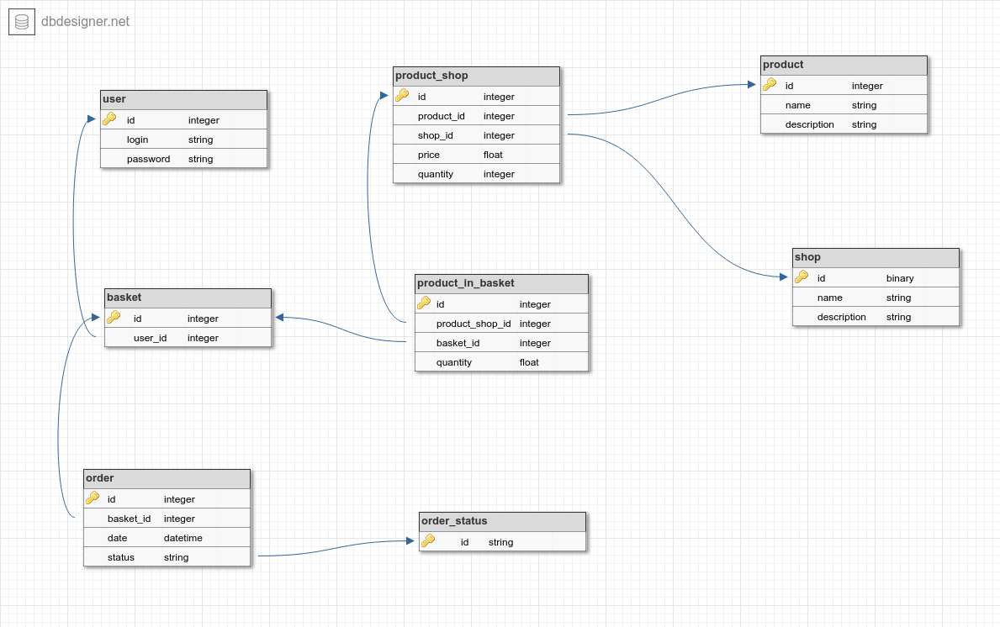
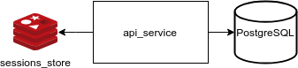
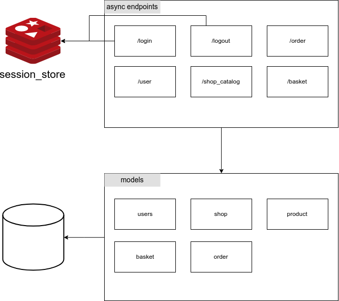

# E-SHOP example 

## Описание
Market-place, который сводит вместе продавцов и покупателей (аналог 
яндекс.маркет, авито). Продавцы загружают товары, покупатели заходят и 
покупают.

### Use Cases
Сущности
 **Customer** - покупатель, пользователь системы
 **Seller** - продавец, пользователь системы. Все продавцы поддерживают
 одинаковые способы оплаты (только безналичные). Но могу поддерживать
 разные способы доставки 
 **System** - система в общем смысле, объединение сервисов, которые 
совместно предоставляют пользователям системы весь требуемый функционал  
#### Загрузка товара
1. **Seller** загружает yml/csv файл с товаром
1. **System** добавляет товар в в свою БД 
1. Товар доступен для **Customer**
#### Пользователь успешно покупает товары
1. **Customer** получает список товаров 
1. **Customer** выбирает товар из списка
1. **Customer** переходит на страницу товара
1. **Customer** добавляет товар в корзину
1. **Customer** возвращается на страницу со списком товаров
1. **Customer** добавляет товар в корзину
1. **System** создает корзину, под каждого **Seller**'а свою
1. **Customer** переходит на страницу корзин
1. **Customer** выбирает тип доставки (если **Seller**'ы разные, то для
каждого **Seller**'а свой тип доставки)
1. **Customer** выбирает способ оплаты
1. **Customer** формирует заказ (или несколько, если товары представляет
разные **Seller**'ы)
1. **Customer** производит оплату заказа
1. **System** резервирует деньги **Customer** на своем счету
1. **System** высылает уведолмение на почту **Seller** о сформированном
заказе
1. **System** высылает уведолмение на почту **Customer** о
сформированном заказе
1. **Customer** ожидает подтверждение заказа от **Seller**
1. **Seller** получает уведолмение на почте с ссылкой на заказ
1. **Seller** переходит по ссылке и **подтверждает** заказ
1. **System** отправляет уведолмение на почту **Customer** о 
подтверждении заказа
1. **Customer** получает уведолмение о подтверждении заказа на почту
1. **Seller** отправляет заказ **Customer**
1. **Customer** получает заказ
#### Пользователь неуспешно покупает товар (продавец отменят заказ)
1. **Customer** получает список товаров 
1. **Customer** выбирает товар из списка
1. **Customer** переходит на страницу товара
1. **Customer** добавляет товар в корзину
1. **Customer** возвращается на страницу со списком товаров
1. **Customer** добавляет товар в корзину
1. **System** создает корзину, под каждого **Seller**'а свою
1. **Customer** переходит на страницу корзин
1. **Customer** выбирает тип доставки (если **Seller**'ы разные, то для
каждого **Seller**'а свой тип доставки)
1. **Customer** выбирает способ оплаты
1. **Customer** формирует заказ (или несколько, если товары представляет
разные **Seller**'ы)
1. **Customer** производит оплату заказа
1. **System** резервирует деньги **Customer** на своем счету
1. **System** высылает уведолмение на почту **Seller** о сформированном
заказе
1. **System** высылает уведолмение на почту **Customer** о
сформированном заказе
1. **Customer** ожидает подтверждение заказа от **Seller**
1. **Seller** получает уведолмение на почте с ссылкой на заказ
1. **Seller** переходит по ссылке и **отменяет** заказ
1. **System** возвращает денежные средства пользователю
1. **System** отправляет уведолмение на почту **Customer** об отмене
заказа и инициализации процедуры возврата денежных средств
1. **Customer** получает уведолмение об отмене заказа на почту
1. После подтверждения возврата денежных средств **System** отправляет
уведолмение на почту пользователю
1. **Customer** получает уведолмение о возврате денежных средств
#### Пользователь ищет товар на сайте
1. **Customer** переходит на главную страницу сайта
1. **Customer** вводит в поисковую строку название искомого товара
1. **Customer** получает список подходящих товаров

## Архитектура проекта
Содержит следующий набор сущностей: 

    • Пользователь
    • Товар
    • Магазин
    • Корзина
    • Заказ

API со следующим набором функций:

    • Авторизация на портале используя связку логин — пароль от лица одного из пользователей
    • Получение данных пользователя (имя, адрес эл. Почты и т.п.)
    • Просмотр истории заказов пользователя
    • Добавление нового заказа (N книг каждая из которых в M количестве)
    • Просмотр ассортимента определенного магазина
    • Деавторизация

### Стек
Фреймворк для написания API — **aiohttp**.
 
Библиотека для общения с базой данных — **sqlalchemy**.
 
В качесве хранилища сессий используется **Redis**.

Сервис работает на **python 3.6**.

### Общая архитектура проекта

### Архитектура сервиса API

## Getting started
Для запуска необходимо выполнить команду: `docker-compose up --build`

После запуска поднимуться следующие контейнеры:

    • Redis
    • PostgeSQL
    • Контейнер накатываня миграций на БД (по завршению контейнер закрывается)
    • Контейнер создания тестовых данных (по завршению контейнер закрывается) 
    • Контейнер веб приложения
    * Контейнер с описанием API (swagger)
Файл shop-api.postman_collection.json содержит примеры запросов на все API.
http://127.0.0.1:8080/ - поднят swagger (не закончена документация)

Все сущности в БД создаются случайным образом. Логины созданных пользователей выводятся в коммандной строке во время создания. 

**Доступ к БД:** 
- localhost:5432 
- db_name: postgres
- user: postgres 
- password: skytrack 

У всех пользователей пароль skytrack

<!--
## Что планируется
### По сервису e-shop
- Создать единый вид ошибок
- Создать единый способ формирования ошибок
- Создать документацию 
- Пересмотреть место получения данных и формирования ответа (унифицировать обработку)
- Добавить пагинацию
- Перейти на structlog и реализовать более подробное логирование
- Реализовать нагрузочное тестирование
- Узкие места перевести на асинхроную библиотеку доступа к БД 

### По архитектуре и деплою
- Добавить ELK и настроить логироание
- Разбить монолит на микросервисы
- Добавить proxy с поддержкой авторизации и "призмеления" https (н-р nginx)
- Добавить возможность масштабирования сервисов - добавить балансировщик (HAProxy)
- Мигрировать на docker stack
- Мигрировать на k8s 
-->